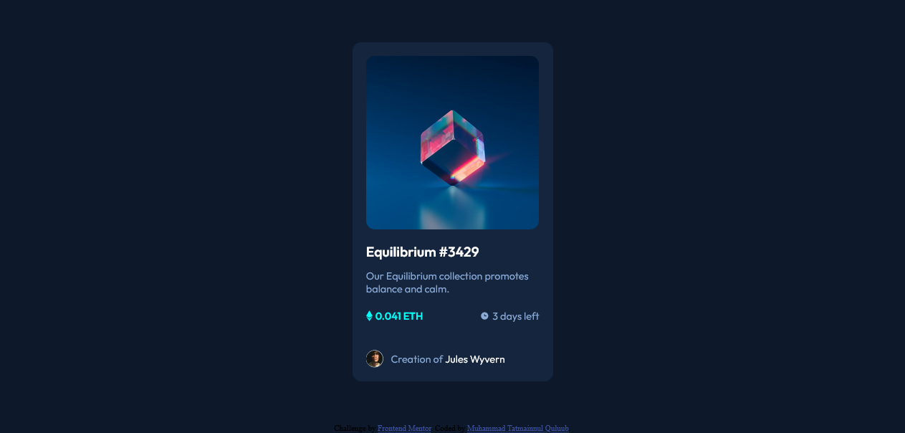

# Frontend Mentor - NFT preview card component solution

This is a solution to the [NFT preview card component challenge on Frontend Mentor](https://www.frontendmentor.io/challenges/nft-preview-card-component-SbdUL_w0U). Frontend Mentor challenges help you improve your coding skills by building realistic projects. 

## Table of contents

- [Overview](#overview)
  - [The challenge](#the-challenge)
  - [Screenshot](#screenshot)
  - [Links](#links)
- [My process](#my-process)
  - [Built with](#built-with)
  - [What I learned](#what-i-learned)  
  - [Useful resources](#useful-resources)
- [Author](#author)

## Overview

### The challenge

Users should be able to:

- View the optimal layout depending on their device's screen size
- See hover states for interactive elements

### Screenshot



### Links

- Solution URL: [Add solution URL here](https://your-solution-url.com)
- Live Site URL: [live site URL](https://muhammadtatma.github.io/nft-preview-card/)

## My process

### Built with

- Semantic HTML5 markup
- CSS Flexbox

### What I learned

while working through this project i find it difficult to apply hover state to the image. finallay i found another CSS property which is  background-image and i found another way to use color in css which is HSLA color.
This my solution looks like this:

```css
.overlay:hover{    
    background-image: url(./images/icon-view.svg);
    background-repeat: no-repeat;
    background-position-x: center;
    background-position-y: center;
    background-color: hsla(178, 100%, 50%, 0.5);    
}
```

### Useful resources

- [CSS background-image property](https://www.w3schools.com/cssref/pr_background-image.asp) - This helped me This helped me explore css background-image property. I really liked this website and will use it going forward.
- [CSS color](https://www.w3schools.com/css/css3_colors.asp) - This is helped me to implement the opacity using HSLA color.


## Author

- Frontend Mentor - [@MuhammadTatma](https://www.frontendmentor.io/profile/MuhammadTatma)
- Twitter - [@MuhammadTatma](https://twitter.com/MuhammadTatma)


